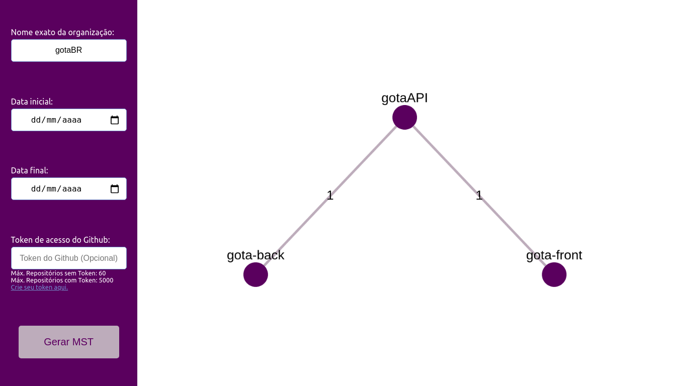
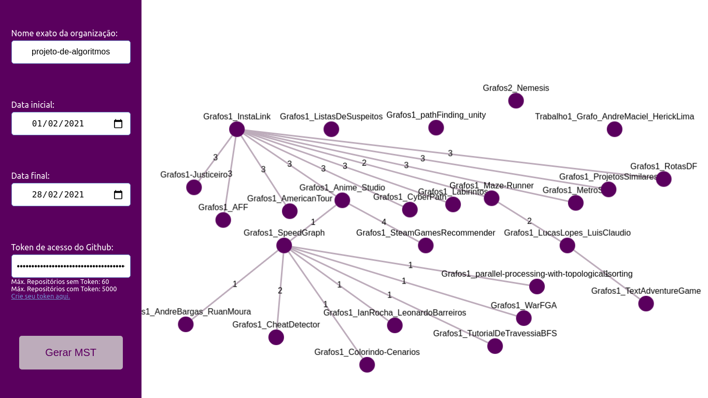

# Projetos Similares (parte 2)

**Conteúdo da Disciplina**: Grafos 2<br>

## Alunos
|Matrícula | Aluno |
| -- | -- |
| 18/0016938  |  Gabriel Paiva Aguiar |
| 18/0025601 |  Murilo Gomes de Souza |

## Sobre 
Esse projeto é uma evolução do [primeiro trabalho de Projeto de Algoritmos](https://github.com/projeto-de-algoritmos/Grafos1_ProjetosSimilares).

O objetivo desse projeto é a avaliação de projetos similares em Organizações do Github na forma de uma **Árvore Geradora Máxima** obtida através do algoritmo de Kruskal aplicado em um grafo gerado anteriormente. Nesse grafo os repositórios são representados como nós e as arestas são as linguagens que esses repositórios podem ter em comum.


## Screenshots
 <br> <br>
 <br> <br>
 <br> <br>

## Instalação 
**Linguagem**: Javascript<br>
**Framework**: React<br>

### Pré-requisitos
Para rodar esse projeto é necessário ter o NodeJS instalado na sua máquina. Ele pode ser adquirido no link abaixo:

```
https://nodejs.org/en/
```

### Como rodar

1. Clone o projeto na sua máquina:
```
git clone https://github.com/projeto-de-algoritmos/Grafos2_ProjetosSimilares
```

2. Entre na pasta do projeto:
```
cd Grafos2_ProjetosSimilares/projetossimilares
```

3. Instale as dependências do projeto:
```
npm install
```

4. Execute o projeto para subir o servidor:
```
npm start
```

5. Acesse o projeto no seu navegador através da url:
```
http://localhost:3000/
```

## Uso 
Para utilizar o projeto, basta preencher os campos de: nome da organização, data inicial e data final, que funcionam como um filtro de busca. Há a opção de inserir um token de acesso ao GitHub para aumentar o número de requisições disponíveis pela API do Github(sem o token são permitidas 60 por hora e com o token são permitidas 5000 por hora).

Para criar seu token de acesso, entre no [link](https://github.com/settings/tokens) e selecione a opção public_repo e gere o token.

